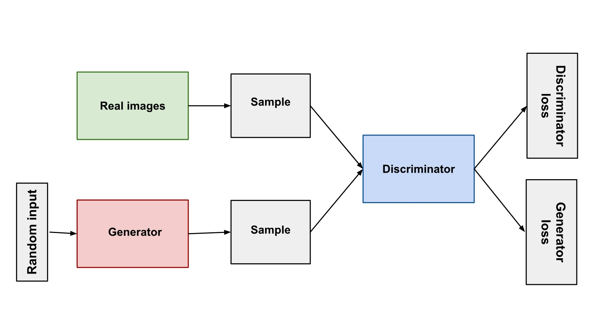
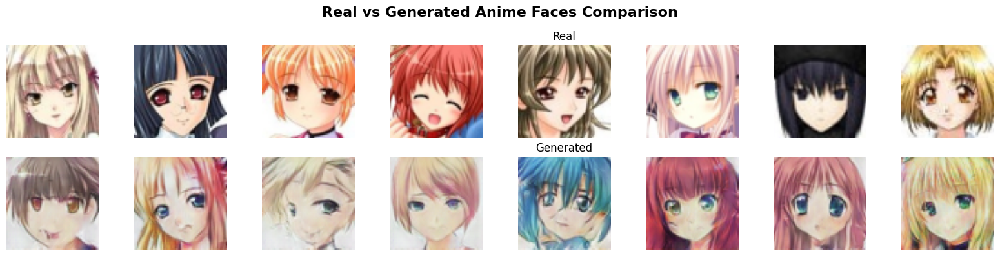

# 🎨 Anime Character Generator (GAN)

A deep learning project that generates high-quality anime-style faces using a Generative Adversarial Network (GAN). Built with PyTorch and trained on thousands of anime face images.

## 🧠 Overview

This project uses a GAN architecture to learn and generate new anime character faces from random noise.

<p align="center">
  
</p>

## 🖼️ Sample Results

Here are some anime faces generated by the GAN after training:

<p align="center">
  
</p>

## ✨ Features

- Generate anime faces from pure noise
- Uses GAN architecture with PyTorch
- Trained on over 60,000 anime face images
- Easily extendable to custom styles or datasets

## 🚀 Getting Started

### 1. Clone the repository
```bash
git clone https://github.com/Ankit-exe/Anime-Character-Generator
```

## 🛠️ Technologies Used

-   Python 🐍
    
-   PyTorch 🔥
    
-   GAN Architecture
    
-   Jupyter Notebook (for experimentation)

## 🙏 Acknowledgements

- [Anime Face Dataset](https://www.kaggle.com/splcher/animefacedataset)
    

